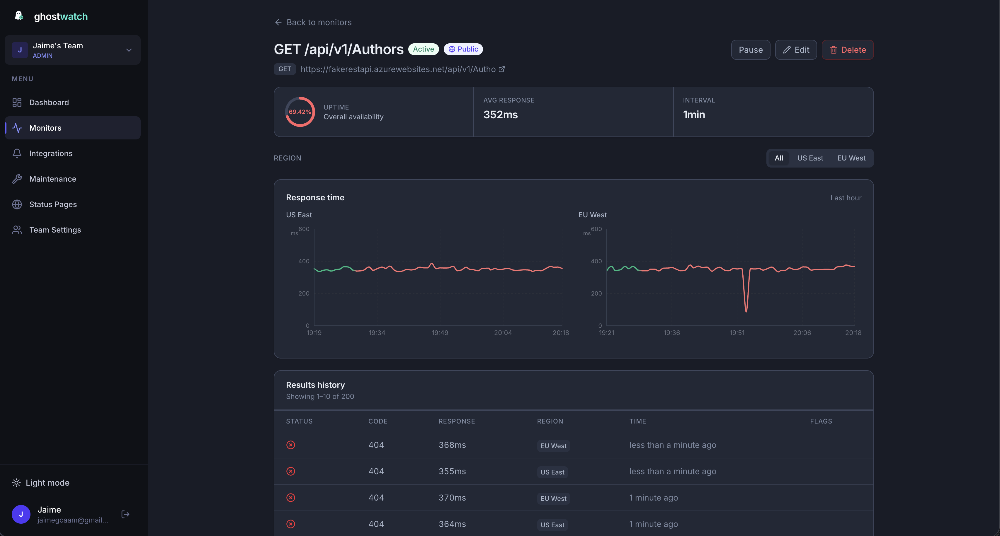

<p align="center">
  
</p>

<h1 align="center">Ghostwatch</h1>

<p align="center">
  <strong>Self-hosted uptime monitoring and public status pages.</strong>
</p>

<p align="center">
  <a href="#quick-start">Quick Start</a>
  ·
  <a href="#why-ghostwatch">Why</a>
  ·
  <a href="#screenshots">Screenshots</a>
  ·
  <a href="#deploy">Deploy</a>
  ·
  <a href="CONTRIBUTING.md">Contributing</a>
</p>

<p align="center">
  <a href="LICENSE"></a>
  
</p>

---

## What is Ghostwatch?

**Ghostwatch** monitors your HTTP endpoints, alerts your team when something breaks, and publishes **public status pages** — all on infrastructure you control.

Built with **Next.js**, **PostgreSQL**, and **Docker**. MIT licensed.

**Who is it for?** Teams that self-host APIs or services and want a private dashboard plus a customer-facing status page at `status.yourcompany.com` — without sending monitor URLs to a third-party SaaS.

---

## Why Ghostwatch?

| | Ghostwatch | Typical SaaS (UptimeRobot, Statuspage, …) |
| --- | --- | --- |
| **Your data** | Your database, your server | Vendor-hosted |
| **Status pages** | Custom domains included | Often a paid add-on |
| **Cost** | Free (MIT) — you pay for infra | Per monitor / per seat |
| **Setup** | One Docker command | Sign up + configure |

**Use Ghostwatch if you want:** uptime checks, Slack/Discord/email alerts, and shareable status pages — without vendor lock-in.

---

## Quick Start

**Requirements:** [Docker](https://docs.docker.com/get-docker/) · takes **under 5 minutes**

```bash
git clone https://github.com/jaimegcaam/ghostwatch.git
cd ghostwatch
npm run docker:init
open http://localhost:3000
```

1. **Register** — the first account becomes the owner  
2. **Checks → New monitor** — paste a URL to watch  
3. Wait ~1 minute — checks run automatically inside the container  

No Node.js? `./scripts/docker-setup.sh && docker compose up -d`

→ [Getting started guide](docs/GETTING-STARTED.md) · [Configuration](docs/CONFIGURATION.md)

---

## Screenshots

<table>
  <tr>
    <td width="50%" align="center">
      
      <br><em>Dashboard — uptime, probes, alerts</em>
    </td>
    <td width="50%" align="center">
      
      <br><em>Monitors — folders, multi-region checks</em>
    </td>
  </tr>
  <tr>
    <td width="50%" align="center">
      
      <br><em>Status page (light)</em>
    </td>
    <td width="50%" align="center">
      
      <br><em>Status page (dark) — custom domain ready</em>
    </td>
  </tr>
</table>


---

## Deploy

| Setup | When to use | Guide |
| --- | --- | --- |
| **Docker — one command** | Easiest start, local or one VPS | [Getting started](docs/GETTING-STARTED.md) |
| **Docker — single server** | Production on one machine | [Docker single server](docs/deploy/docker-single-server.md) |
| **Docker — multi-region** | Checks from several locations | [Docker multi-region](docs/deploy/docker-multi-region.md) |
| **Kubernetes — Helm** | Production on K8s | [Helm install](docs/deploy/kubernetes-helm.md) |
| **Kubernetes — YAML** | K8s without Helm | [Raw manifests](docs/deploy/kubernetes-manifests.md) |
| **Kubernetes — multi-region** | Hub + workers on K8s | [K8s multi-region](docs/deploy/kubernetes-multi-region.md) |
| **Local dev** | Hacking on the source code | [Local development](docs/deploy/local-development.md) |

Full index: [docs/deploy/README.md](docs/deploy/README.md)

---

## Features

- HTTP checks with folders and optional multi-region probes
- Alerts — Slack, Discord, webhooks, email (Resend)
- Public status pages on `/s/<slug>` or your own domain
- Invite-only teams after the owner account exists

---

## Contributing

Ghostwatch is open source and contributions are welcome — bug reports, docs, and pull requests.

Read [CONTRIBUTING.md](CONTRIBUTING.md) · Report security issues via [SECURITY.md](SECURITY.md) (not public issues)

**Star the repo** if you find it useful — it helps other developers discover it.

MIT License — see [LICENSE](LICENSE).
