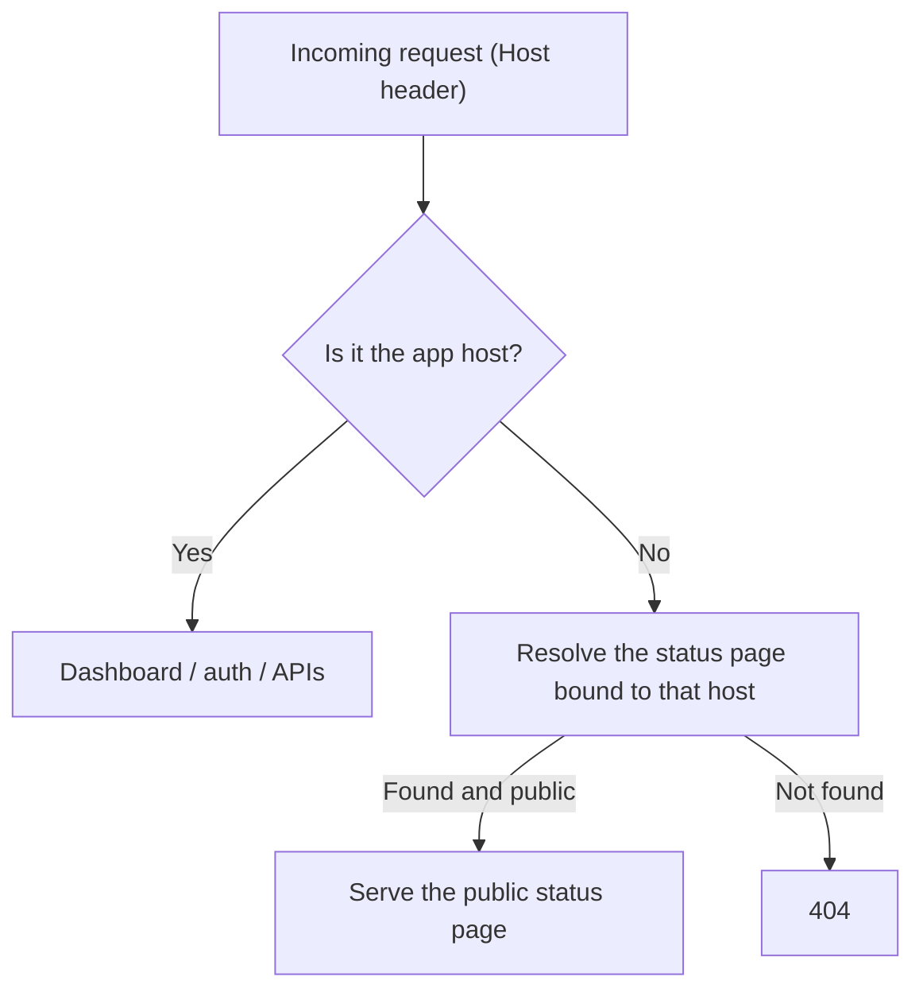

# Ghostwatch

**Open-source, self-hosted uptime monitoring with public status pages.**

Run your own monitoring instance, keep the dashboard private, and expose only
the status pages you choose — on your own custom domains.

- Self-host with Docker, Kubernetes (Helm or raw manifests), or local dev.
- Invitation-only: the first user becomes the owner; everyone else joins only when an owner invites them.
- Public status pages on custom domains (`status.yourcompany.com`), one or more per page.
- Monitors organized in folders, run from configurable regions, with sustained-outage
  detection (a single blip shows as *degraded*, not a false red) and incident history.
- Alert channels for Slack, Discord, generic webhooks, and email (multiple recipients).
- Your database, your data. MIT licensed.

---

## Deployment guides

Choose the guide that fits your environment. Each one is a short, copy-paste
runbook.

| Guide | When to use |
| --- | --- |
| [**Local development**](docs/deploy/local-development.md) | Coding with hot reload (`npm run dev`) |
| [**Docker — single server**](docs/deploy/docker-single-server.md) | One machine, simplest production setup |
| [**Docker — multi-region**](docs/deploy/docker-multi-region.md) | Hub + regional workers (Compose) |
| [**Kubernetes — Helm**](docs/deploy/kubernetes-helm.md) | Production K8s with `helm install` |
| [**Kubernetes — raw manifests**](docs/deploy/kubernetes-manifests.md) | Plain YAML under `k8s/` |
| [**Kubernetes — multi-region**](docs/deploy/kubernetes-multi-region.md) | Hub on K8s + workers in other regions |

Full index: [`docs/deploy/README.md`](docs/deploy/README.md).

### Fastest start (Docker, one server)

```bash
cp .env.docker.example .env
echo "AUTH_SECRET=$(openssl rand -base64 32)" >> .env
echo "CRON_SECRET=$(openssl rand -base64 32)" >> .env
docker compose up -d
open http://localhost:3000
```

Details, updates, and teardown → [Docker — single server](docs/deploy/docker-single-server.md).

---

## Custom domains for status pages

Each status page has a built-in URL (`https://<APP_HOST>/s/<slug>`) and can also
serve from one or more custom domains.

1. In the dashboard open **Status Pages → edit a page → Custom domains** and add
   a hostname (e.g. `status.yourcompany.com`). Make the page **public**.
2. At your DNS provider, add a **CNAME** for that hostname pointing at
   `STATUS_CNAME_TARGET` (defaults to `APP_HOST`).
3. Make sure your reverse proxy / Ingress terminates HTTPS for that hostname and
   forwards it to Ghostwatch. With Helm, add the domain to `ingress.statusDomains`.
4. Click **Check DNS** in the UI to confirm propagation — verified domains are
   marked and the result is saved.

Requests to a custom domain only ever serve that page's status page; the
dashboard and APIs stay on the main app host.

---

## Monitoring regions

A **region** is *where* a health check runs from. Each monitor can use one or
more regions; results are stored with that region id.

| Setup | Guide |
| --- | --- |
| Single server (default) | [Docker — single server](docs/deploy/docker-single-server.md) |
| Hub + workers (Docker) | [Docker — multi-region](docs/deploy/docker-multi-region.md) |
| Hub + workers (Kubernetes) | [Kubernetes — multi-region](docs/deploy/kubernetes-multi-region.md) |

Configure region ids and **dashboard labels** on the hub:

```bash
# Labels as the third field (recommended)
PROBE_ENDPOINTS="us-east-1|https://probe-va.corp.com|North Virginia,eu-south-2|https://probe-madrid.corp.com|Spain"
```

Or override labels with `MONITORING_REGIONS="id|Label,..."`. Each worker sets
`PROBE_REGION` to match its id. See the multi-region guides for the full layout.

---

## How it works



### Access control

Ghostwatch is **invitation-only by design** — there is no public sign-up:

1. The **first** user to register becomes the **owner** (set `OWNER_EMAIL` to lock
   this to a specific address).
2. After that, people can join **only** when an owner/admin invites their email to
   a team (**Teams → Members → Invite**). They register with that exact email and
   are added on first sign-in.
3. Signing in always requires an existing account.

`AUTH_TRUST_HOST` is enabled by default so login works on your own host out of the
box.

---

## Configuration

Set via `.env` (Docker/dev), ConfigMap/Secret (k8s), or Helm values.

| Variable | Required | Description |
| --- | --- | --- |
| `DATABASE_URL` | yes | PostgreSQL connection string |
| `NEXTAUTH_URL` | yes | Public URL of the dashboard |
| `APP_HOST` | yes | Dashboard hostname (for custom-domain routing) |
| `AUTH_SECRET` | yes | Auth.js secret (`openssl rand -base64 32`) |
| `CRON_SECRET` | yes | Shared secret for the scheduler endpoint |
| `AUTH_TRUST_HOST` | no | Trust the request host (default `true`; set `false` behind a host-rewriting proxy) |
| `STATUS_CNAME_TARGET` | no | CNAME target shown in status-page instructions |
| `OWNER_EMAIL` | no | Lock first-user bootstrap to a specific email |
| `SELF_HOSTED` | no | `true` (default); `false` only disables owner email auto-verification |
| `STATUS_OUTAGE_THRESHOLD` | no | Consecutive failures before a monitor counts as down / opens an incident (default `3`) |
| `MONITORING_REGIONS` | no | Optional UI override: `id\|Label` pairs (defaults to `PROBE_ENDPOINTS` labels) |
| `PROBE_ENDPOINTS` | no | Hub only: `id\|https://probe-host\|Label` per worker |
| `PROBE_WORKER` | no | Set `true` on regional workers (disables scheduler) |
| `DEFAULT_REGION` | no | Region preselected for new monitors |
| `PROBE_REGION` | no | Region id for a worker instance (default `local`) |
| `PROBE_REGION_LABEL` | no | Display label for a single in-process probe (optional) |
| `ENABLE_BUILTIN_SCHEDULER` | no | Run checks from the app process (default `true`) |
| `CRON_INTERVAL_MS` | no | Scheduler interval (default 60000) |
| `RESEND_API_KEY` / `FROM_EMAIL` | no | Transactional email (invitations, alerts) |
| `GOOGLE_*` / `GITHUB_*` | no | Optional OAuth providers |

---

## Tech stack

- Next.js 16 (App Router, standalone output)
- PostgreSQL 16 via Prisma 7
- Auth.js / NextAuth v5
- Tailwind CSS v4
- Recharts

---

## Project layout

```
ghostwatch/
├── docs/deploy/            # Deployment runbooks (Docker, K8s, multi-region)
├── charts/ghostwatch/      # Helm chart → charts/ghostwatch/README.md
├── k8s/                    # Raw Kubernetes manifests → k8s/README.md
├── docker-compose.yml      # Single-server stack
├── docker-compose.regions.yml  # Local hub + 2 workers (test)
├── Dockerfile              # Production image
├── prisma/                 # Schema + migrations
├── scripts/                # setup, cron worker, container entrypoint
└── src/
    ├── app/                # Next.js App Router
    │   ├── domain/         # Custom-domain entrypoint
    │   └── s/[slug]/       # Public status pages
    ├── middleware.ts       # Custom-domain routing
    └── lib/                # Domain logic (status domains, checks, auth)
```

---

## License & contributing

MIT — see [LICENSE](LICENSE). Contributions welcome — see
[CONTRIBUTING.md](CONTRIBUTING.md). Found a security issue? Please report it
privately per [SECURITY.md](SECURITY.md).
