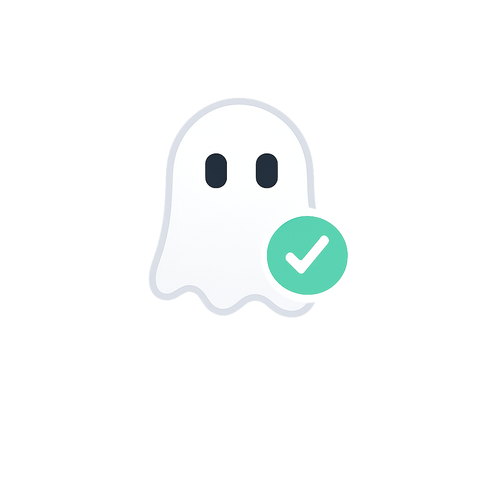
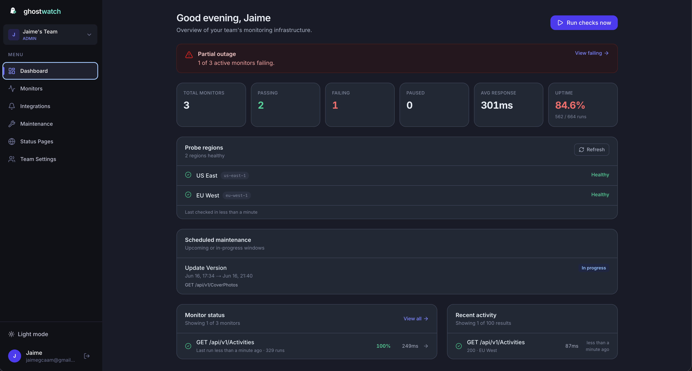
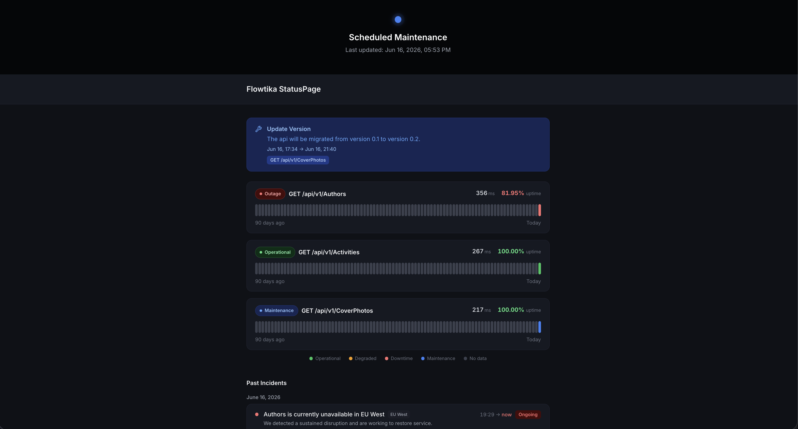
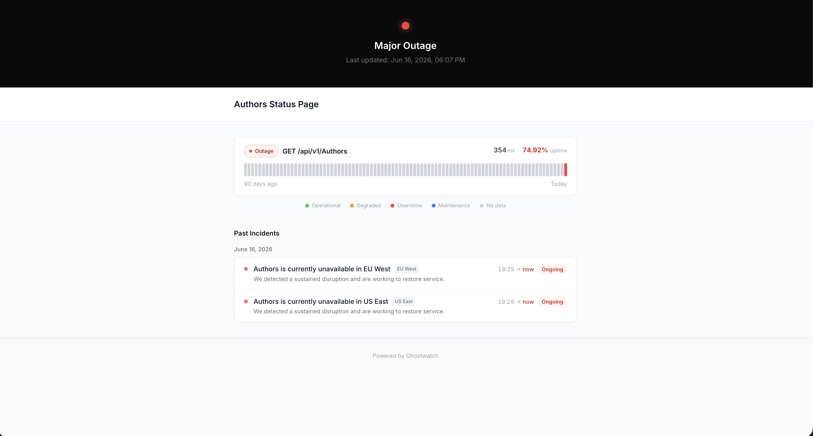

<p align="center">
  
</p>

<h1 align="center">Ghostwatch</h1>

<p align="center">
  <strong>Self-hosted uptime monitoring and public status pages.</strong><br>
  Monitor your APIs, alert your team, share status with your users — on your own infrastructure.
</p>

<p align="center">
  <a href="LICENSE"></a>
  
</p>

---

## Features

- HTTP checks with folders and multi-region probes
- Alerts — Slack, Discord, webhooks, email
- Public status pages on `/s/<slug>` or your own domain
- Invite-only teams · Docker, Kubernetes (Helm), multi-region workers

---

## Quick Start

**Requirements:** [Docker](https://docs.docker.com/get-docker/)

```bash
git clone https://github.com/jaimegcaam/ghostwatch.git
cd ghostwatch
npm run docker:init
open http://localhost:3000
```

1. **Register** — the first account becomes the owner  
2. **Checks → New monitor** — add a URL to watch  
3. Wait ~1 minute — checks run automatically  

No Node.js? `./scripts/docker-setup.sh && docker compose up -d`

More: [Getting started](docs/GETTING-STARTED.md) · [Configuration](docs/CONFIGURATION.md)

---

## Screenshots

<table>
  <tr>
    <td width="50%" align="center">
      
    </td>
    <td width="50%" align="center">
      
    </td>
  </tr>
  <tr>
    <td width="50%" align="center">
      
    </td>
    <td width="50%" align="center">
      
    </td>
  </tr>
</table>

---

## Deploy

| Setup | When to use | Guide |
| --- | --- | --- |
| **Docker — one command** | Easiest start, local or one VPS | [Getting started](docs/GETTING-STARTED.md) |
| **Docker — single server** | Production on one machine | [Docker single server](docs/deploy/docker-single-server.md) |
| **Docker — multi-region** | Checks from several locations | [Docker multi-region](docs/deploy/docker-multi-region.md) |
| **Kubernetes — Helm** | Production on K8s | [Helm install](docs/deploy/kubernetes-helm.md) |
| **Kubernetes — YAML** | K8s without Helm | [Raw manifests](docs/deploy/kubernetes-manifests.md) |
| **Kubernetes — multi-region** | Hub + workers on K8s | [K8s multi-region](docs/deploy/kubernetes-multi-region.md) |
| **Local dev** | Hacking on the source code | [Local development](docs/deploy/local-development.md) |

Full index: [docs/deploy/README.md](docs/deploy/README.md)


[Contributing](CONTRIBUTING.md) · [Security](SECURITY.md) · MIT License
